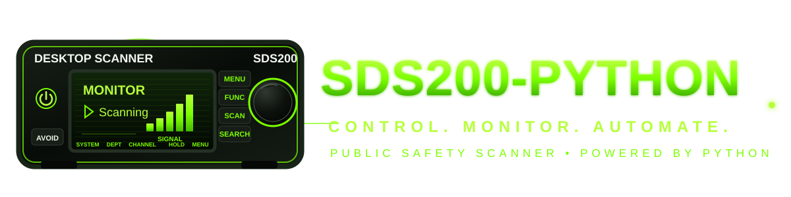

# sds200-python

<p align="center">
  
</p>

[](https://github.com/stevenboyd78/sds200-python/actions/workflows/ci.yml)


Python control and monitoring library for the **Uniden SDS100, SDS150, and
SDS200** scanners. All three models support USB serial control; the SDS200 also
supports native Ethernet control.

The project provides a typed Python API and an `sdsctl` command-line tool for
scanner discovery, status monitoring, commands, connection profiles, diagnostics,
and live state updates.

> [!IMPORTANT]
> This project is alpha software. The public API may change before version 1.0.
> It is not affiliated with or endorsed by Uniden.

## Interface preview


*The current Textual TUI rendered by the real application with fictional
demonstration data. No scanner, agency, channel, endpoint, or recording
information in this image represents a real system.*

## Features

- USB serial control for SDS100, SDS150, and SDS200 scanners
- Native SDS200 Ethernet control over UDP
- Model detection, aliases, capability reporting, and model-specific limits
- Model-aware handheld battery reporting: optional SDS100 GSI telemetry and SDS150 GCS charge status
- Automatic USB and bounded LAN discovery
- Saved serial, network, and automatic fallback profiles
- Preferred transport ordering with live USB/Ethernet failover and opt-in recovery
- Typed commands and responses, including documented hold/next/previous navigation
- Structured `GSI` and continuous `PSI` scanner information
- Thread-safe synchronized radio state and change events
- Live terminal monitoring
- Optional responsive [Textual full-screen TUI](docs/tui.md) for Raspberry Pi and
  terminal use with non-blocking scanner and SDS200 audio-recording controls
- Exponential reconnect backoff with configurable retry limits
- Traffic tracing, replayable JSON Lines session capture, and deterministic replay
- Bounded health history plus failover and preferred-recovery diagnostics
- Configurable operational logging to stderr, journald, or a logrotate-managed file
- Automatic rate-limited recovery from a connected-but-stale TUI PSI stream
- JSON Lines events for connection, retry, failover, and state changes
- Discovery-based repair for stale USB paths and scanner IP addresses
- Hardware-validated SDS200 network audio over RTSP/RTP
- Native G.711 mu-law decoding with independently buffered PCM destinations
- Versioned Broadcastify destination profiles with environment-backed secret
  references and validated adapter conversion
- Optional renderer-neutral live stream metadata with newest-value buffering,
  duplicate suppression, rate limiting, and Broadcastify-compatible alpha-tag
  updates isolated from PSI and PCM delivery
- Renderer-neutral audio encoder process lifecycle with immutable commands,
  bounded shutdown, stderr diagnostics, and injectable process factories
- Pluggable local playback with bounded newest-audio buffering, preserved
  PortAudio behavior, and explicit PipeWire, PulseAudio, and ALSA adapters
- Per-subscriber PCM health snapshots, ordered transitions, lifecycle metrics,
  redacted errors, and isolated startup, submission, and shutdown failures
- Renderer-neutral single-owner runtime for scanner control, PSI, one RTSP/RTP
  fanout, dynamic PCM destinations, immutable snapshots, and deterministic cleanup
- Versioned local daemon API over a private Unix-domain socket with
  backward-compatible snapshots, capability-checked scanner controls, strict
  JSON Lines envelopes, bounded clients, and deterministic shutdown
- Versioned ordered local daemon event stream over a separate private Unix
  socket with authoritative snapshots, bounded subscriptions, and explicit
  sequence-gap resynchronization
- Versioned bounded local daemon PCMU stream over a third private Unix socket with
  accepted RTP payloads, continuity metadata, and independent client-loss counters
- Optional live playback through the local default or selected audio output device
- Simultaneous local playback and streaming PCM WAV recording from one RTSP session
- UDP XML fragment validation, statistics, and bounded retries
- Bash and Zsh tab completion
- Strict MyPy typing, Ruff checks, and hardware-independent tests

Network audio remains independent from scanner control, so playback and recording
do not open or affect the USB serial or UDP control transport. See the
[project roadmap](ROADMAP.md) for ordered work and the
[project vision](docs/project-vision.md) for broader deferred capabilities.

## Requirements

- Python 3.11 or newer
- A Uniden SDS100, SDS150, or SDS200
- For USB: scanner connected as a serial device
- For Linux desktop USB access, see the optional [udev rule](docs/udev.md)
- For Ethernet: scanner and computer on a trusted local network

Linux USB, Ethernet control, and RTSP/RTP audio recording have been validated
with an SDS200 running firmware version 1.26.01. SDS100 USB control has also been
validated on firmware 1.26.01. SDS150 support follows Uniden's shared SDS-series
remote-command specification and still needs physical-hardware validation.
Explicit SDS200 network hosts work on any platform supported by Python's TCP and
UDP sockets. Automatic route detection and `/dev/serial/by-id` discovery are
Linux-specific.

## Installation

Install the published package from PyPI:

```bash
python -m pip install sds200
```

Install the optional full-screen TUI:

```bash
python -m pip install "sds200[tui]"
```

Install optional local audio playback support:

```bash
python -m pip install "sds200[playback]"
```

On Linux, the Python extra requires the operating system's PortAudio runtime.
Install it on Debian or Raspberry Pi OS before starting playback:

```bash
sudo apt update
sudo apt install libportaudio2
```

Inspect the PortAudio build, host APIs, default output, and output-capable devices:

```bash
sdsctl audio-devices
```

Depending on the operating-system audio stack and PortAudio build, Linux devices
may be exposed through ALSA, PipeWire compatibility, PulseAudio compatibility, or
JACK. The CLI and TUI continue to use PortAudio by default. Python integrations can
instead construct a `BufferedPlaybackSink` with `PipeWirePlaybackAdapter`,
`PulseAudioPlaybackAdapter`, or `AlsaPlaybackAdapter`; the corresponding `pw-cat`,
`pacat`, or `aplay` executable must be installed.

Install the TUI with live and saved-recording playback:

```bash
python -m pip install "sds200[tui,playback]"
```

Install from source for development:

```bash
git clone https://github.com/stevenboyd78/sds200-python.git
cd sds200-python
python3 -m venv .venv
source .venv/bin/activate
python -m pip install --upgrade pip
```

For development:

```bash
python -m pip install -e ".[dev]"
```

## Quick start

### Find connected scanners

Search USB and directly connected IPv4 networks:

```bash
sdsctl discover
```

Search a specific network:

```bash
sdsctl discover --network 192.168.0.0/24 --network-only
```

Active LAN discovery sends the read-only `MDL` command to each usable host.
Only scan networks you own or are authorized to probe.

### USB serial

Show scanner information using automatic model detection:

```bash
sdsctl info
```

Select a specific model when multiple USB scanners are connected:

```bash
sdsctl --model SDS100 info
sdsctl --model SDS150 info
```

Start the live monitor:

```bash
sdsctl monitor
```

Launch the optional Textual interface:

```bash
sdsctl tui
```

Press `Q` to quit, `T` to switch semantic palettes, `C` to reconnect, `G` to
show or hide the operational log panel, and `?` for the full keyboard reference.
The TUI provides non-blocking scanner controls, responsive compact, standard,
and wide layouts, dense short-screen audio and PSI summaries, live and saved
SDS200 audio playback, repeatable recordings, mode-aware special-screen panels,
operational logging, and rate-limited stale-PSI recovery through USB, network,
profile, and replay selectors. A sustained stale PSI stream is automatically
reconnected without stopping active network audio; see the
[Textual TUI guide](docs/tui.md).

With an explicit SDS200 network host, opt in to WAV recording and use `R` to start
or stop the one-shot recording session:

```bash
sdsctl --host 192.168.0.251 tui \
  --audio-output scanner-audio.wav
```

Use an explicit port when automatic discovery is not appropriate:

```bash
sdsctl \
  --port /dev/serial/by-id/usb-UNIDEN_AMERICA_CORP._SDS200_Serial_Port-if00 \
  info
```

### SDS200 Ethernet

```bash
sdsctl --host 192.168.0.251 info
sdsctl --host 192.168.0.251 scanner-info
sdsctl --host 192.168.0.251 monitor
```

The SDS200 virtual serial service uses UDP port `50536` by default.

### Foreground SDS200 daemon

Run one long-lived scanner-control, PSI, and network-audio ownership runtime in
the foreground:

```bash
sdsctl --log-level INFO --host 192.168.0.251 daemon
```

A saved network or fallback SDS200 profile may supply the endpoint:

```bash
sdsctl --log-level INFO --profile home daemon
```

The process owns one scanner control session, one PSI stream, one SDS200
RTSP/RTP session, and one decoded-PCM router. A fallback profile may use serial
control while its configured network host remains the audio endpoint.

The daemon exposes three versioned local services through private Unix-domain
sockets:

- `$XDG_RUNTIME_DIR/sdsctl/daemon.sock`, or the user-state fallback, provides the
  request-response API for authoritative snapshots and safe typed scanner
  controls. Select an explicit absolute path with `--socket-path`.
- `$XDG_RUNTIME_DIR/sdsctl/events.sock`, or the user-state fallback, provides the
  ordered JSON Lines event stream. Select an explicit absolute path with
  `--event-socket-path`.
- `$XDG_RUNTIME_DIR/sdsctl/pcmu.sock`, or the user-state fallback, provides
  accepted RTP PCMU packets through a bounded binary stream. Select an explicit
  absolute path with `--pcmu-socket-path`.

Every event client first receives an authoritative runtime snapshot at the
current global sequence boundary, then only later runtime, scanner, PSI,
radio-state, audio-lifecycle, and destination-health events. Sequence gaps show
that an event subscriber overflowed; reconnect to obtain a new authoritative
snapshot.

Every PCMU client receives only packets accepted after its independent
subscription is created. Frames preserve RTP sequence, timestamp, SSRC,
continuity estimates, observation time, endpoint, raw payload bytes, and
cumulative loss caused by that client's bounded queue.

Stop the process with `Ctrl+C` or `SIGTERM`. Shutdown first closes API clients,
then stops scanner, PSI, audio, and router ownership, closes PCMU clients, and
finally closes event clients after final lifecycle transitions. All three owned
sockets are removed.

The command remains in the foreground for service-manager ownership. It does not
fork, create a pidfile, install a service, expose TCP, accept unrestricted raw
scanner commands, or provide decoded-PCM client subscriptions. The local API
supports documented `hold`, `next`, `previous`, and bounded `reconnect`
operations. Reconnect is available only when the daemon directly owns the SDS200
UDP control transport; fallback or serial control returns
`unsupported_operation`. Existing CLI and TUI workflows remain standalone. The
initial router has no attached destinations. See the
[daemon runtime and process guide](docs/daemon-runtime.md),
[local daemon API guide](docs/daemon-api.md),
[local daemon event stream guide](docs/daemon-events.md),
[local daemon PCMU stream guide](docs/daemon-pcmu.md), and
[operational logging](docs/logging.md).

Serial-only profiles, replay captures, and non-SDS200 network-audio selections
are rejected.

### SDS200 network audio playback and recording

Listen to the scanner through the operating system's default audio output:

```bash
sdsctl --host 192.168.0.251 audio --play
```

Record the scanner's RTSP/RTP audio directly to an 8 kHz mono signed 16-bit PCM
WAV file without requiring FFmpeg:

```bash
sdsctl --host 192.168.0.251 audio \
  --output scanner-audio.wav \
  --duration 30
```

Omit `--duration` to record until `Ctrl+C`. Existing files are protected unless
overwrite is explicitly enabled:

```bash
sdsctl --host 192.168.0.251 audio \
  --output scanner-audio.wav \
  --force
```

Playback and recording can share one RTSP/RTP session:

```bash
sdsctl --host 192.168.0.251 audio \
  --play \
  --output scanner-audio.wav
```

Use `--device DEVICE` to choose a PortAudio output device and `--buffer-ms` to
change the bounded playback queue. Playback underflow inserts silence; overflow
drops the oldest queued audio so the output remains live. The summary reports both
conditions and the number of dropped PCM bytes.

The scanner requires a nonstandard single RTP client port during RTSP `SETUP`.
The built-in transport handles that negotiation, receives payload type 0 PCMU,
decodes each accepted packet once, and fans the PCM out to independently buffered
destinations. WAV disk writes and local sound-device callbacks cannot block RTP
reception. The same long-lived fanout session powers TUI playback, repeatable
recording, and saved-recording controls without opening a second scanner stream.

Each recording summary reports estimated packet loss, duplicates, late and
malformed packets, and RTP timestamp discontinuities. A five-minute SDS200
hardware soak received 7,500 packets and 2,400,000 audio samples with every
reliability counter remaining at zero.

### Connection profiles and fallback

Create a profile directly from USB and LAN discovery:

```bash
sdsctl profile discover home \
  --network 192.168.0.0/24 \
  --prefer network
```

When both endpoints are found, the profile automatically falls back between
Ethernet and USB. The saved preference can be overridden for one command:

```bash
sdsctl --profile home --prefer serial monitor
```

Preferred recovery is disabled by default. Enable validated return to the saved
preferred endpoint when creating a fallback profile:

```bash
sdsctl profile discover home \
  --network 192.168.0.0/24 \
  --prefer network \
  --recover-preferred \
  --recovery-probe-interval 30 \
  --recovery-stability-window 5 \
  --recovery-cooldown 30
```

Override the saved recovery policy for one process:

```bash
sdsctl --profile home \
  --recover-preferred \
  --recovery-probe-interval 15 \
  monitor
```

Recovery opens the inactive preferred endpoint, sends `MDL`, verifies that an
SDS200 responds, waits through the stability window, probes again, and promotes
only while no request/response command is pending. Continuous PSI updates are
restarted after promotion.

Manual profiles remain supported, including explicit fallback profiles:

```bash
sdsctl profile add network-only --host 192.168.0.251
sdsctl profile add usb-only \
  --port /dev/serial/by-id/usb-UNIDEN_AMERICA_CORP._SDS200_Serial_Port-if00 \
  --model SDS200
sdsctl profile add handheld --port /dev/ttyACM0 --model SDS150
sdsctl profile add home \
  --port /dev/serial/by-id/usb-UNIDEN_AMERICA_CORP._SDS200_Serial_Port-if00 \
  --host 192.168.0.251 \
  --prefer network \
  --recover-preferred
```

Profiles are stored in `${XDG_CONFIG_HOME:-~/.config}/sds200/profiles.toml`.
This legacy connection-profile document remains separate from layered application
configuration, and `--config PATH` continues to override only this profile file.

### Layered application configuration

Optional application settings are loaded from `/etc/sdsctl/config.toml`,
`${XDG_CONFIG_HOME:-~/.config}/sdsctl/config.toml`, supported `SDSCTL_*`
environment variables, and explicit CLI options in that precedence order.
Missing files preserve the existing defaults and are never created automatically.

See [Layered application configuration](docs/configuration.md) for the versioned
TOML schema, supported fields, environment-variable names, path behavior,
validation rules, and Python provenance API.

Repair stale USB paths or a changed scanner IP address without losing the saved
transport preference:

```bash
sdsctl profile repair home --network 192.168.0.0/24
sdsctl profile repair home --network 192.168.0.0/24 --dry-run
```

### Reliability, health, and events

```bash
sdsctl --profile home health
sdsctl --profile home health --watch 5 --history
sdsctl --profile home health --watch 5 --history --json
sdsctl --profile home events --json
sdsctl --host 192.168.0.251 --trace scanner.trace monitor
```


Select an operational log level or append logs to a persistent file:

```bash
sdsctl --log-level INFO --host 192.168.0.251 monitor
sdsctl --log-level DEBUG --log-file /var/log/sdsctl.log \
  --host 192.168.0.251 events
```

`-v` selects `INFO`, `-vv` selects `DEBUG`, and an explicit `--log-level`
overrides verbosity. Raw scanner traffic remains separate under `--trace`.
See [Operational logging](docs/logging.md) for journald, permissions, and
logrotate examples.

Reconnects use capped exponential backoff. Retry forever by default, or set a
finite recovery budget:

```bash
sdsctl --profile home \
  --reconnect-attempts 8 \
  --reconnect-initial-delay 1 \
  --reconnect-multiplier 2 \
  --reconnect-max-delay 30 \
  monitor
```

`events --json` emits one JSON object per line for connection changes,
transport diagnostics, reconnect scheduling, failovers, preferred recoveries, and live state changes.

### Capabilities, capture, and replay

Show the connected model's limits and validation status:

```bash
sdsctl --model SDS100 capabilities
```

Record a replayable session and then run the same operation without hardware:

```bash
sdsctl --model SDS100 --capture sds100-info.jsonl info
sdsctl --replay sds100-info.jsonl --model SDS100 info
```

Captures can contain local scanner data. Use repeated `--redact TEXT` options and
inspect files before sharing them. See [Session capture and replay](docs/replay-and-capture.md).

### Typed navigation

The documented `HLD`, `NXT`, and `PRV` operations are available through
typed APIs and CLI commands:

```bash
sdsctl --model SDS100 hold SYS 100
sdsctl --model SDS100 next DEPT 200 100 --count 2
sdsctl --model SDS100 previous TGID 300
```

Targets and indexes are protocol values reported by GSI or GLT. The typed
navigation layer is specification-backed and replay-tested; smoke-test it on
the intended scanner before relying on it operationally. Prefer a replay fixture
when developing navigation logic without a scanner attached.

### Raw protocol commands

```bash
sdsctl command MDL
sdsctl command VER
sdsctl command GCS  # SDS150 charge status
sdsctl command VOL
sdsctl command SQL
sdsctl command STS
```

Raw command access is intended for documented scanner commands and protocol
development. Prefer the typed Python methods when they are available.

## Shell completion

Activate Bash completion for the current shell:

```bash
eval "$(sdsctl completion bash)"
```

Enable it whenever Bash starts:

```bash
echo 'eval "$(sdsctl completion bash)"' >> ~/.bashrc
```

For Zsh:

```zsh
eval "$(sdsctl completion zsh)"
```

## Python API

### USB

```python
from sds200 import SDSScanner

with SDSScanner.auto(model="SDS150") as radio:
    print(radio.get_model())
    print(radio.get_firmware())
    print(radio.get_volume())
    print(radio.get_squelch())
```

### SDS200 Ethernet

```python
from sds200 import SDSScanner

with SDSScanner.network("192.168.0.251") as radio:
    info = radio.get_scanner_info()
    print(info.system)
    print(info.department)
    print(info.channel)
    print(info.frequency)
```

### Continuous state updates

```python
from sds200 import SDSScanner

with SDSScanner.network("192.168.0.251") as radio:
    radio.on_state_change(
        lambda change: print(change.fields, change.current.channel)
    )

    with radio.scanner_info_push(interval_ms=500):
        radio.wait()
```

### Reconnect policy and health history

```python
from sds200 import ReconnectPolicy, SDSScanner

policy = ReconnectPolicy(
    initial_delay=1.0,
    multiplier=2.0,
    max_delay=30.0,
    max_attempts=8,
)

with SDSScanner.network("192.168.0.251", reconnect_policy=policy) as radio:
    print(radio.health_check().as_dict())
    print(radio.health_summary().as_dict())
```

### LAN discovery

```python
from sds200 import discover_network_scanners

for scanner in discover_network_scanners(["192.168.0.0/24"]):
    print(scanner.endpoint, scanner.model, scanner.latency_ms)
```

## Project naming

The model-neutral executable is `sdsctl`. New application configuration,
state, and cache paths use the `sdsctl` namespace. The distribution, Python import
package, and repository remain named `sds200`, while legacy profile files remain
under the existing `sds200` configuration root. Python applications should use
`SDSScanner`; the historical `SDS200` class name remains an alias.

## Security

The SDS200 network-control protocol is unauthenticated and unencrypted. Keep it
on a trusted LAN or access it through a secured VPN. Do not expose UDP port
`50536` directly to the public Internet.

This library is not a safety-critical or emergency-dispatch system. Do not rely
on it as the sole means of receiving urgent communications.

See [SECURITY.md](SECURITY.md) for vulnerability reporting and
[docs/transports.md](docs/transports.md) for transport limitations.

## Documentation

- [GitHub Wiki](https://github.com/stevenboyd78/sds200-python/wiki)
  — task-oriented installation, setup, and troubleshooting guides
- [Project roadmap](ROADMAP.md)
- [Supported scanner models](docs/supported-models.md)
- [Control transports](docs/transports.md)
- [LAN discovery and profiles](docs/discovery-and-profiles.md)
- [Layered application configuration](docs/configuration.md)
- [Fallback profiles](docs/fallback-profiles.md)
- [Reliability and observability](docs/reliability.md)
- [Operational logging](docs/logging.md)
- [Textual TUI](docs/tui.md)
- [Foreground daemon and ownership runtime](docs/daemon-runtime.md)
- [Local daemon API](docs/daemon-api.md)
- [Local daemon event stream](docs/daemon-events.md)
- [Local daemon PCMU stream](docs/daemon-pcmu.md)
- [Audio subsystem architecture](docs/audio.md)
- [Acknowledgments](ACKNOWLEDGMENTS.md)
- [Contributing](CONTRIBUTING.md)
- [Support](SUPPORT.md)
- [Roadmap](ROADMAP.md)
- [Project vision](docs/project-vision.md)
- [Changelog](CHANGELOG.md)
- [Release process](docs/releasing.md)

## Development

```bash
python -m pip install -e ".[dev]"

ruff check .
mypy src/sds200
pytest
python scripts/check_docs.py
python -m build
python -m twine check dist/*
```

Tests must not require physical scanner hardware. Hardware validation is
documented separately in pull requests and release notes.

## Project status

Version `0.15.0` hardens the optional Textual workstation interface for sustained
Raspberry Pi operation. It adds configurable operational logging, automatic
rate-limited recovery from a connected-but-stale PSI stream, and deterministic
fault-injection coverage for audio startup, shutdown, repeated requests, and
scanner reconnects. Failed PSI reconnects preserve their requested update interval
so recovery continues after control traffic returns, while active SDS200 network
audio remains uninterrupted. SDS100 and SDS200 control support is
hardware-validated. SDS150 support is implemented and fixture-tested, but physical
validation is deferred until representative hardware is available. It does not
block unrelated releases. API compatibility is not guaranteed until version 1.0.

See [CHANGELOG.md](CHANGELOG.md) for development history,
[ROADMAP.md](ROADMAP.md) for ordered work, and
[the project vision](docs/project-vision.md) for deferred capabilities and
architectural direction.

## Acknowledgments

This project is created and maintained by Steven Boyd, with substantial development
assistance from OpenAI's ChatGPT. AI-assisted contributions are reviewed and tested
by the maintainer before inclusion. See [ACKNOWLEDGMENTS.md](ACKNOWLEDGMENTS.md).

## License

MIT. See [LICENSE](LICENSE).
