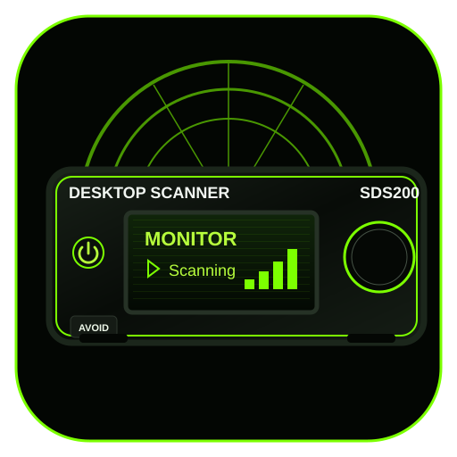
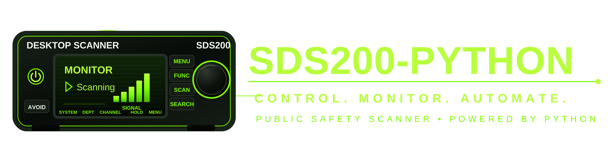
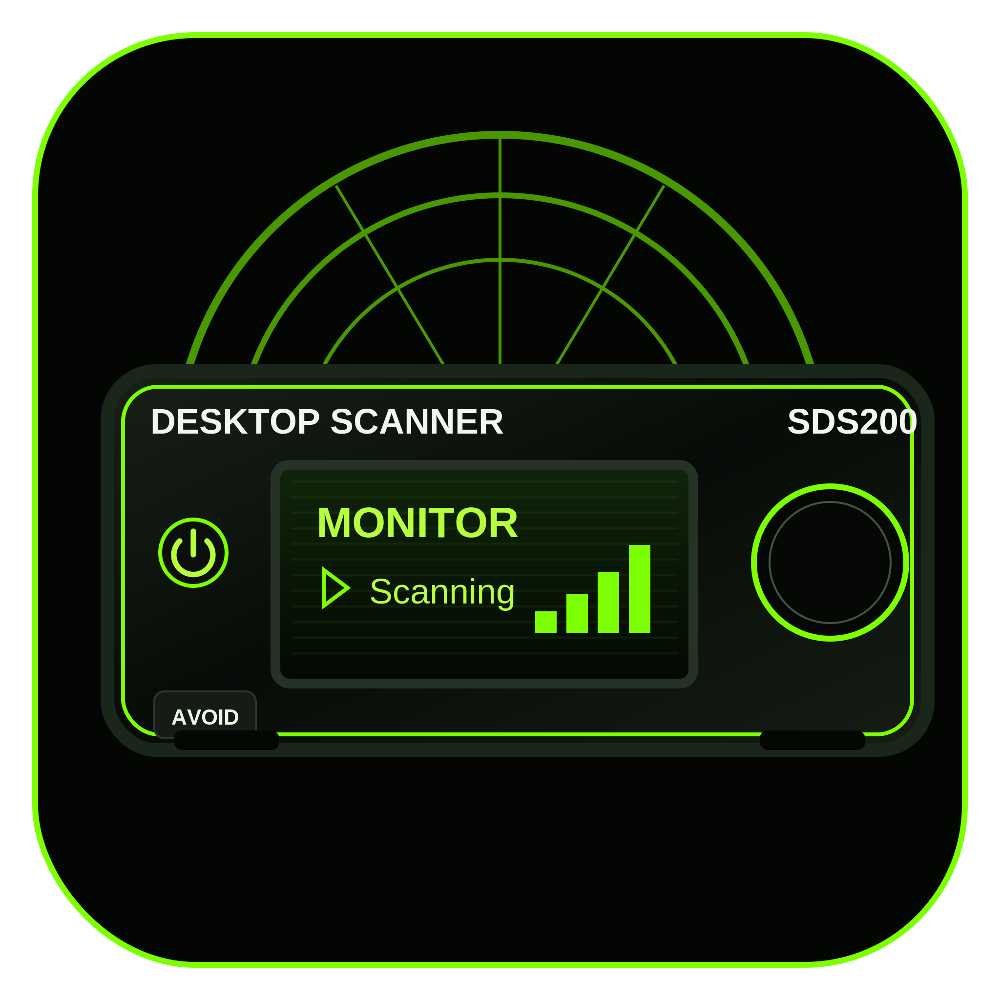
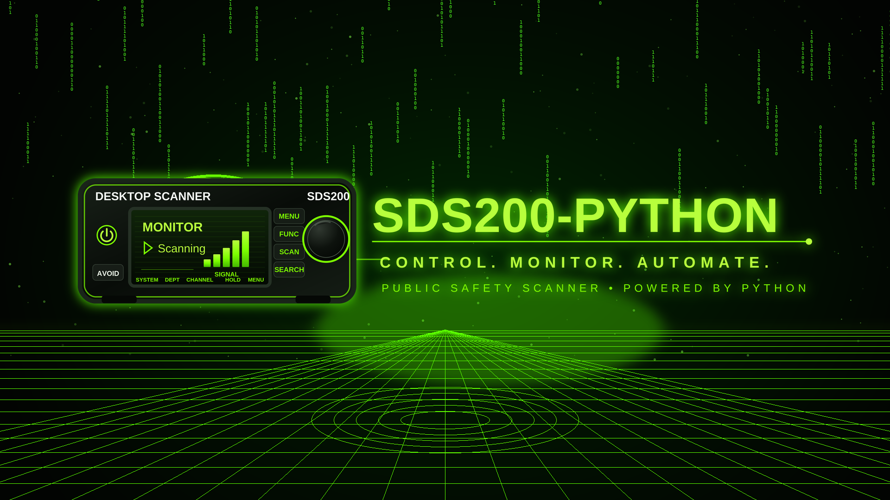

# Neon branding assets

This directory contains the final generic, no-channel-reference neon green branding set.

## Files

- `sds200-python-logo.svg` — primary horizontal vector logo
- 
- `sds200-python-icon.svg` — square vector icon
- 
- `sds200-python-logo-4k.png` — 4800×1200 transparent PNG
- 
- `sds200-python-icon-2048.png` — 2048×2048 transparent PNG
- 
- `sds200-python-wallpaper-1080p.png` — 1920×1080 wallpaper
- 
- `sds200-python-wallpaper-4k.png` — 3840×2160 wallpaper
- 

The scanner display is intentionally generic and contains no agency, location,
talkgroup, frequency, or specific channel information.
