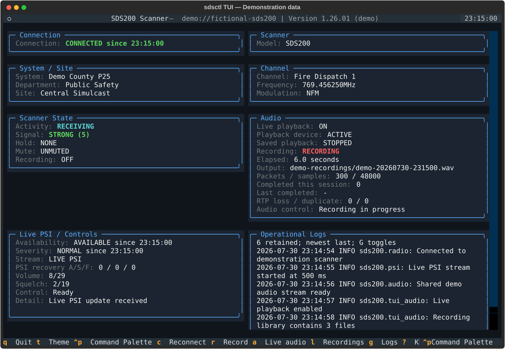
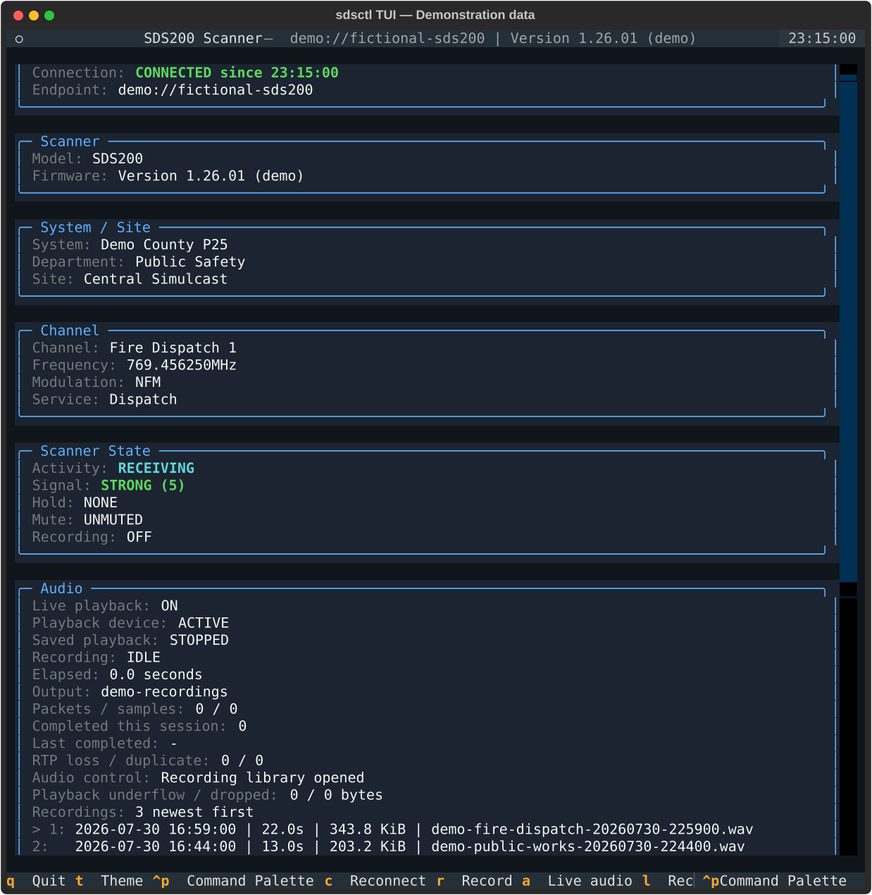
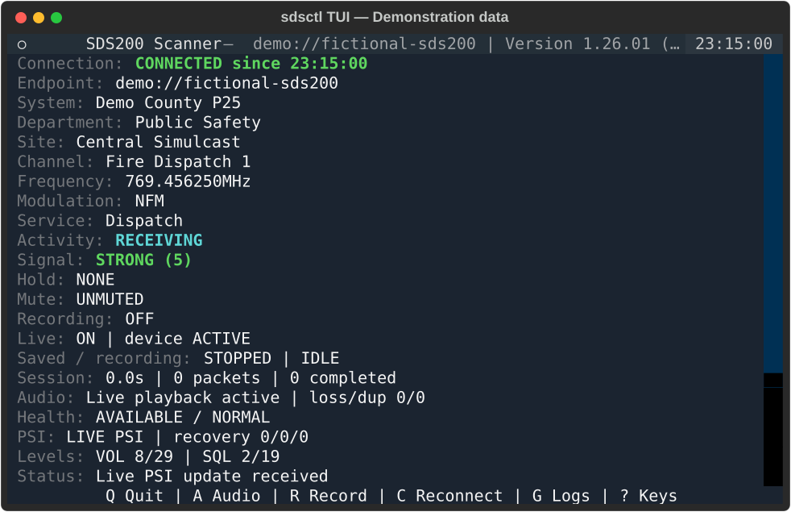

# Textual TUI

Version 0.13 introduced the optional full-screen Textual interface for SDS
scanners, and version 0.14 added integrated SDS200 network-audio recording.
Version 0.16 adds immediate live playback, repeatable recordings, a saved
recording library, recording metadata sidecars, a bounded in-app operational log
panel, and mode-aware Quick Search, Close Call, Weather, and Tone Out panels.
Textual and PortAudio remain optional so the core installation
stays lightweight.

## Interface previews

These images are generated by the real `ScannerTuiApp` with deterministic,
fictional demonstration data. They do not contain scanner captures, private
endpoints, agency information, or recordings from a real system.

### Wide operational view



The wide layout places the main operational panels in two columns and keeps the
bounded log panel visible across the full width.

### Recording library



The recording library presents compatible WAV recordings newest first and
supports selection, playback, pause, resume, and return to live audio.

### Compact layout



The compact layout removes decorative borders and reduces panel spacing for small
terminals and Raspberry Pi displays.

Install the optional interface from PyPI:

```bash
python -m pip install "sds200[tui]"
```

For source development, the `dev` extra includes Textual:

```bash
python -m pip install -e ".[dev]"
```

Launch the interface with the same USB, network, profile, or replay selectors used
by other `sdsctl` commands:

```bash
sdsctl tui
sdsctl --host 192.168.0.251 tui
sdsctl --profile home tui
sdsctl --replay tests/fixtures/replay/sds100-tui-live.jsonl tui
```

The TUI starts continuous PSI scanner-information updates after loading the model,
firmware, and initial GSI snapshot. The default 500 ms update interval and 3 second
freshness threshold may be adjusted independently:

```bash
sdsctl --host 192.168.0.251 tui --interval 250 --stale-after 2
```

When a UDP transport remains logically connected but stops delivering PSI frames,
the TUI warns at the stale threshold and automatically queues the existing
nonblocking reconnect operation after 10 seconds. Attempts are rate-limited to
one per 60 seconds and do not stop an active SDS200 network-audio recording:

```bash
sdsctl --host 192.168.0.251 tui \
  --psi-recover-after 10 \
  --psi-recovery-cooldown 60
```

Use `--no-psi-auto-recover` to retain warning-only behavior. The recovery
never begins before `--stale-after`; a smaller recovery value is
raised to the stale threshold. Operational recovery
entries can be persisted with the options described in
[Operational logging](logging.md).

The interface shows:

- connection endpoint and connected, degraded, or disconnected status with the local transition time
- scanner model and firmware
- system, department, and site during normal scanning screens
- channel, frequency, modulation, and service type during normal scanning
- mode-aware Quick Search and Close Call panels showing the raw screen mode,
  source state node, search frequency or hit name, modulation, hold state,
  signal, RSSI, and scanner-reported detected tone or digital code
- mode-aware Weather panels showing the raw screen mode, `WxChannel` state node,
  weather channel and number, frequency, modulation, monitor or alert mode,
  hold state, signal, RSSI, and scanner-reported SAME selection
- mode-aware Tone Out panels showing the raw screen mode, `ToneOutChannel` state
  node, profile and channel number, monitored frequency, modulation, Tone A and
  Tone B values, hold state, signal, and RSSI
- semantic activity, signal, hold, mute, and recording state
- live PSI, reconnect, diagnostic, and stale-data status
- automatic PSI recovery attempt, success, and failure totals
- a bounded newest-last operational log panel, visible by default
- availability and severity derived from the shared presentation model, each with the local transition time

Radio callbacks originate on control-transport threads. The adapter marshals every
widget update into Textual's event loop, unsubscribes callbacks on shutdown, and
stops PSI before the scanner connection closes. Reconnects retain the last known
state while making its disconnected or stale status explicit.

The interface uses the same renderer-independent `ScannerPresentation`,
`ThemeRole`, and light/dark palettes as the Rich CLI. Meaning remains visible in
text labels rather than relying on color alone.

Quick Search, Close Call, Weather, and Tone Out screens were physically
validated on an SDS200 running firmware `1.26.01` over the UDP control
transport. One continuous PSI session successfully transitioned through normal
conventional and trunk scanning, Quick Search Hold, Close Call searching and
Hold, Weather Scan and Hold, Tone Out standby and Hold, and back to normal
scanning.

The physical scanner reported Close Call Only frequency states through
`SrchFrequency`; its `cc_searching` screen contained no frequency node. Weather
Scan and Hold both used `V_Screen="wx_alert"` with `WxChannel`, while Tone Out
used `ToneOutChannel` with profile, index, channel number, monitored frequency,
Tone A, Tone B, and hold state. Temporary menu frames may retain a weather
screen or node while mode navigation is in progress.

Raw hardware captures remain outside the repository because they contain local
scanner data. Sanitized synthetic fixtures preserve the observed structures.
`CcHitsChannel`, SAME alert content, and an actual Tone Out detection were not
observed during this validation and remain specification-backed synthetic
coverage rather than claimed physical validation.

Keyboard shortcuts:

- `Q`: exit, stop PSI, unsubscribe callbacks, and close the connection
- `T`: toggle between the built-in dark and light semantic palettes
- `C`: restart the control transport and resume the active PSI interval
- `R`: start or stop an SDS200 network-audio WAV recording
- `A`: toggle live scanner playback without stopping the RTSP/RTP stream
- `L`: show or hide the newest compatible recordings
- `G`: show or hide the operational log panel without discarding buffered records
- `Up` / `Down`: select a saved recording
- `Enter`: play the selected recording and temporarily suspend live playback
- `Space`: pause or resume saved playback
- `Esc`: stop saved playback, restore enabled live playback, and close the library
- `Ctrl+P`: open Textual's Command Palette
- `?`: show or hide the complete keyboard reference
- `H`: hold the current indexed channel
- `S`: hold the current indexed system
- `D`: hold the current indexed department
- `I`: hold the current indexed site
- `N`: move to the next indexed channel
- `P`: move to the previous indexed channel
- `+` / `-`: raise or lower volume
- `]` / `[`: raise or lower squelch

Scanner commands execute sequentially on a background worker so a slow command
round trip does not block the Textual event loop. Hold controls use the documented
system, department, site, TGID, or conventional-frequency indexes from live GSI/PSI
state. Channel next/previous controls require a documented `TGID` or conventional
frequency index. The status panel reports queued, completed, unavailable, and
failed controls without relying on color alone. The connection, availability, and
severity labels include `since HH:MM:SS` using local time; the timestamp changes only
when the displayed state changes. Repeated unchanged PSI frames still refresh data
freshness, preventing an active but stable channel from aging into a false stale state.
Only an actual absence of valid PSI frames triggers automatic recovery.

While the full-screen TUI is active, package log records are routed to the bounded
in-app panel instead of stderr so they cannot corrupt the Textual display. The
panel retains the newest 200 lines and displays the newest six; hiding it with `G`
does not stop collection. An optional `--log-file` handler remains active and
continues receiving every record allowed by the selected log level. Normal stderr
logging is restored when the TUI exits.

The deterministic `sds100-tui-controls.jsonl` replay is a strict, one-shot command
script rather than a scanner simulator. For a manual control pass, start a fresh TUI
session and tap `H`, `S`, `D`, `I`, `N`, `P`, `+`, and `]` exactly once in that
order. Quit and restart the replay to reset its command cursor after any deviation.

## Responsive Raspberry Pi layout

The interface adapts automatically to terminal dimensions; no compact-mode flag is
required. Terminals narrower than 80 columns remove decorative borders and spacing.
At fewer than 32 rows, the dedicated identity panel is hidden while the model remains
in the title and the endpoint and firmware remain in the header subtitle. The main
content stays vertically scrollable, so no scanner state is discarded.

At 120 columns or wider, panels switch to a two-column dashboard. An 80 by 24
terminal is the recommended Raspberry Pi starting size, while a 64 by 20 terminal is
supported as the compact regression-test target. Press `?` when the compact footer
only shows the essential quit, theme, and key-reference actions.

The same responsive classes are exercised in headless Textual tests at compact and
wide terminal sizes.

## Network audio playback, recording, and library

TUI audio requires an explicit SDS200 network host. Every such TUI session exposes
manual live and saved playback controls. Request automatic live playback and create
repeatable timestamped recordings in one directory:

```bash
sdsctl --host 192.168.0.251 tui \
  --audio-playback \
  --audio-directory ~/recordings
```

Install both optional feature sets for that workflow:

```bash
python -m pip install "sds200[tui,playback]"
```

On Debian or Raspberry Pi OS, also install the PortAudio runtime:

```bash
sudo apt update
sudo apt install libportaudio2
```

Use `sdsctl audio-devices` to inspect the default output, PortAudio host APIs, and
output-capable devices before launching the TUI.

Press `A` to start live playback manually, even when `--audio-playback` was not
provided. The output device opens only when playback first starts and remains
prepared while playback is muted, avoiding repeated PortAudio initialization.

Use `--audio-playback` to request automatic startup after the scanner is connected
and the first live PSI update has been displayed. Select a different output with
`--audio-device`, and adjust the bounded playback queue with `--audio-buffer-ms`.

Press `R` to start and stop recordings. Directory mode generates local-time names
such as `sds200-20260729-025501.wav`; collisions add `-2`, `-3`, and later suffixes.
Use `--audio-template` to replace the basename while retaining the required
`{timestamp}` field. The legacy `--audio-output FILE` mode remains protected and
one-shot; `--audio-force` applies only to that explicit file.

Press `L` to show up to `--audio-history-limit` compatible 8 kHz mono signed 16-bit
PCM WAV files, newest first. Each row includes its filesystem timestamp, duration,
size, and filename. Select with the arrow keys, press `Enter` to play, use `Space`
to pause or resume, and press `Esc` to stop and close the library. Saved playback
temporarily suspends local live playback but does not stop scanner reception or an
active recording. Previously enabled live playback resumes automatically.

The audio panel reports live and saved playback state, active output, elapsed time,
packet and sample totals, completed-session count, last completed file, recording
history, playback underflows and drops, and RTP reliability counters. TUI shutdown
finalizes an active WAV, stops saved playback, closes the output device, and tears
down the shared RTSP/RTP stream. Advanced transport options remain available as
`--audio-rtsp-port`, `--audio-rtp-bind-address`, `--audio-rtp-bind-port`, and
`--audio-keepalive-interval`.

Project authorship and AI-assisted development are documented in [Acknowledgments](../ACKNOWLEDGMENTS.md).
